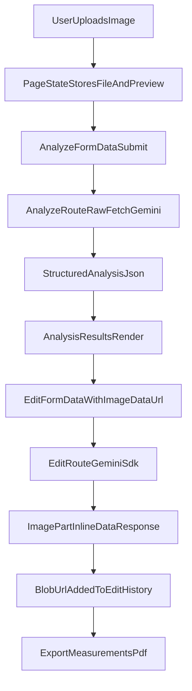

# Interior Analyzer Build Plan

## Confirmed Scope And Baseline
- Target project path: [C:\Others\project\Builtattic\vit_interior_analyzer](C:\Others\project\Builtattic\vit_interior_analyzer).
- Reference projects reviewed before implementation:
  - [C:\Others\project\Builtattic\vit_iterate](C:\Others\project\Builtattic\vit_iterate)
  - [C:\Others\project\Builtattic\vit_error_compliance](C:\Others\project\Builtattic\vit_error_compliance)
- Gemini integration strategy (confirmed):
  - Analyze route uses the `vit_error_compliance` style (raw `fetch` to Gemini endpoint for structured JSON output).
  - Edit route uses the `vit_iterate` style (`@google/generative-ai` SDK).
- No git commands will be run.

## Scope And Constraints (Merged From Prior Plan)
- Keep route and naming conventions aligned with:
  - [C:\Others\project\Builtattic\vit_iterate\src\app\api\iterate\route.ts](C:\Others\project\Builtattic\vit_iterate\src\app\api\iterate\route.ts) for image-edit SDK usage and `inlineData` image parts.
  - [C:\Others\project\Builtattic\vit_error_compliance\src\app\api\compliance\route.ts](C:\Others\project\Builtattic\vit_error_compliance\src\app\api\compliance\route.ts) for FormData parsing/validation and structured JSON handling.
- Analyze route remains raw-fetch pattern; edit route remains SDK pattern.
- Typecheck is a phase gate after each major phase; build is a final gate.

## Phase-by-Phase Execution

## Phase 1 — Scaffold And Core Theming
- Initialize Next.js 14 app in the existing directory with TypeScript, Tailwind, App Router, and `src/` layout.
- Install required dependencies: `@google/generative-ai`, `lucide-react`, `clsx`, `jspdf`.
- Create `.env.local` with `GEMINI_API_KEY` placeholder.
- Replace [src/app/globals.css](src/app/globals.css) with the provided tokenized dark design system and animations.
- Extend [tailwind.config.ts](tailwind.config.ts) colors/fonts with `bg/surface/accent` and `IBM Plex Mono` + `Syne` mappings.
- Run `npx tsc --noEmit` and resolve any scaffold/type mismatches immediately.

## Phase 2 — App Shell And Header
- Implement [src/app/layout.tsx](src/app/layout.tsx) using `next/font/google` (`Syne`, `IBM_Plex_Mono`), metadata, and global header mount.
- Build [src/components/AppHeader.tsx](src/components/AppHeader.tsx) as a client component:
  - Sticky top bar with logo mark/text and product label.
  - Desktop status indicators.
  - Mobile menu toggle + animated drawer panel.
- Verify responsive header behavior and run `npx tsc --noEmit`.

## Phase 3 — Main Page Upload + Calibration + Analyze Trigger
- Build [src/app/page.tsx](src/app/page.tsx) as client component with all requested state, refs, derived values, and handlers:
  - File validation and upload preview.
  - Drag/drop with hover state.
  - Upload inline error with timed reset.
  - Optional calibration UI (target + value).
  - Undo/restart handlers and blob URL cleanup semantics.
- Implement hero/layout sections in the exact order and visibility conditions.
- Add analyze button with loading/idle styles and helper copy.
- Run `npx tsc --noEmit`.

## Phase 4 — Analysis API + Results Rendering
- Add shared types in [src/types/index.ts](src/types/index.ts) (including `AnalysisResult`, `DetectedObject`, confidence unions).
- Create [src/app/api/analyze/route.ts](src/app/api/analyze/route.ts):
  - `runtime = "nodejs"`.
  - Parse `FormData` fields.
  - Convert `File` to base64 (`Buffer.from(arrayBuffer).toString("base64")`).
  - Build calibration context and strict JSON-only prompt contract.
  - Use raw Gemini `fetch` pattern from `vit_error_compliance` with `process.env.GEMINI_API_KEY`.
  - Parse text response to JSON and return standardized success/error payloads.
- Create [src/components/AnalysisResults.tsx](src/components/AnalysisResults.tsx) with confidence badges, dimensions grid, notes card, and object table.
- Wire `handleAnalyze` in [src/app/page.tsx](src/app/page.tsx), including smooth scroll to results and error handling.
- Run `npx tsc --noEmit`.

## Phase 5 — Image Viewer + Edit Panel + Edit API (Critical Path)
- Build [src/components/ImageViewer.tsx](src/components/ImageViewer.tsx) with before/after toggle, status pills, and edit overlay spinner.
- Build [src/components/EditPanel.tsx](src/components/EditPanel.tsx) with three tabs (`remove/add/material`), prompts, surface toggles, apply button, error box, undo/restart row.
- Implement [src/app/api/edit/route.ts](src/app/api/edit/route.ts) with SDK pattern aligned to `vit_iterate`:
  - `runtime = "nodejs"`.
  - Parse form fields (`imageData`, `editType`, `editPrompt`, `materialSurface`).
  - Parse base64 data URL and mime type.
  - Build instruction text per edit type.
  - Use `GoogleGenerativeAI` + `getGenerativeModel`.
  - Pass input image as `inlineData: { mimeType, data }`.
  - Configure generation with response modalities for image output.
  - Extract generated image from response parts (`part.inlineData`) and return base64 + mime type.
- Wire `handleEdit` in [src/app/page.tsx](src/app/page.tsx) and blob conversion pipeline.
- Run `npx tsc --noEmit`.

### Phase 5 explicit safeguard (your requested check)
- Add a mandatory validation checkpoint after implementing edit route:
  - Confirm request payload includes `inlineData` with `mimeType` + base64 `data`.
  - Confirm model config requests image output modalities (image + text).
  - If response returns only text or empty image parts, first debug target is modalities/config mismatch.
  - If modality rejection occurs, switch model to `gemini-2.5-flash-image` as fallback.

## Phase 6 — PDF Export
- Add [src/utils/exportPdf.ts](src/utils/exportPdf.ts) with the provided `jsPDF` report generator and dark report styling.
- Add export section/button in [src/app/page.tsx](src/app/page.tsx), filename derivation from uploaded file name, and explanatory copy.
- Run `npx tsc --noEmit`.

## Phase 7 — Polish, Responsiveness, And Build
- Add analysis skeleton UI while waiting for result.
- Add analysis error banner below analyze button.
- Complete mobile checks:
  - `AnalysisResults` dimension grid collapse.
  - Calibration panel responsive grid.
  - Edit tab text hidden on very small screens (`hidden sm:inline`) with icons always visible.
  - Image viewer mobile height (`max-h-[260px] md:max-h-[420px]`).
  - Header drawer transitions/functionality.
- Final validation:
  - `npx tsc --noEmit` with zero errors.
  - `npm run build` with zero errors/warnings.

## Data Flow (Implementation Reference)

## Key Files To Create/Modify
- [src/app/globals.css](src/app/globals.css)
- [tailwind.config.ts](tailwind.config.ts)
- [src/app/layout.tsx](src/app/layout.tsx)
- [src/app/page.tsx](src/app/page.tsx)
- [src/app/api/analyze/route.ts](src/app/api/analyze/route.ts)
- [src/app/api/edit/route.ts](src/app/api/edit/route.ts)
- [src/components/AppHeader.tsx](src/components/AppHeader.tsx)
- [src/components/AnalysisResults.tsx](src/components/AnalysisResults.tsx)
- [src/components/ImageViewer.tsx](src/components/ImageViewer.tsx)
- [src/components/EditPanel.tsx](src/components/EditPanel.tsx)
- [src/types/index.ts](src/types/index.ts)
- [src/utils/exportPdf.ts](src/utils/exportPdf.ts)
- [.env.local](.env.local)

## Implementation Notes (Merged From Prior Plan)
- Keep app workflow state centralized in [src/app/page.tsx](src/app/page.tsx); keep presentational logic in component files.
- Preserve strict blob URL cleanup for `editHistory` on undo/restart/unmount.
- Keep Gemini concerns strictly separated:
  - Analyze: image-in, text/JSON-out.
  - Edit: image-in, image-out.
- Maintain route/file organization under `src/app/api/` consistent with both reference projects.
- Model selection policy for execution:
  - Analyze route default model hardcoded to `gemini-2.5-flash` with optional env override if present.
  - Edit route default model hardcoded to `gemini-3.1-flash-image-preview`.
  - If image modality/model compatibility fails in edit route, fallback to `gemini-2.5-flash-image`.
  - Existing env vars like `GEMINI_MODEL` and `GEMINI_IMAGE_MODEL` may be read as non-breaking overrides, but defaults remain explicit in route code.
